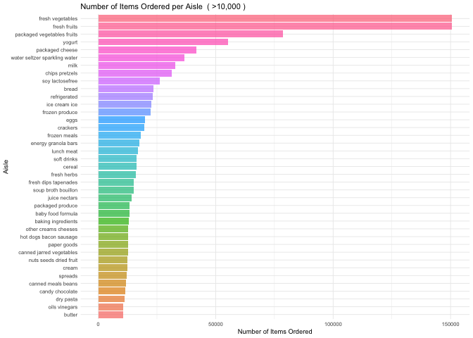
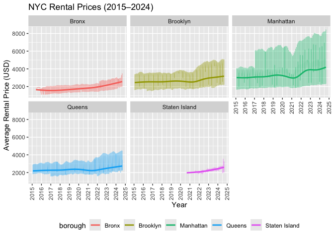
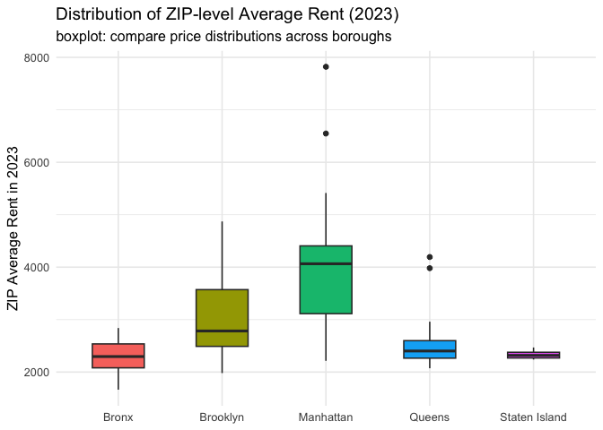
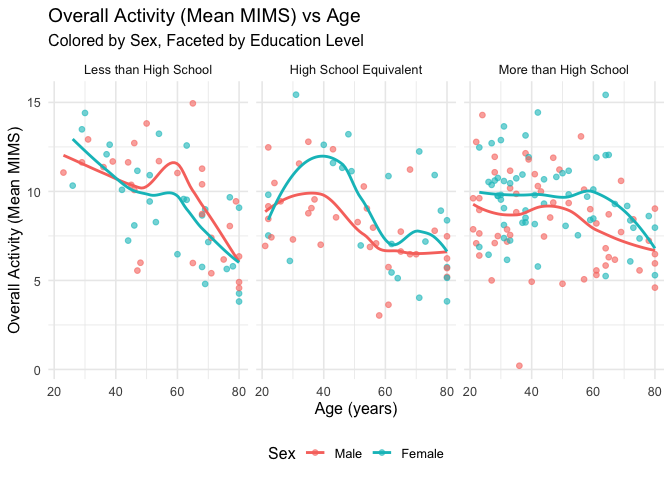
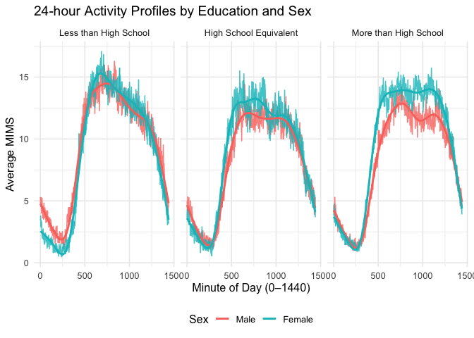

HW3 1
================

Loading Libraries

``` r
library(p8105.datasets)
library(tidyverse)
```

    ## ── Attaching core tidyverse packages ──────────────────────── tidyverse 2.0.0 ──
    ## ✔ dplyr     1.1.4     ✔ readr     2.1.5
    ## ✔ forcats   1.0.0     ✔ stringr   1.5.1
    ## ✔ ggplot2   4.0.0     ✔ tibble    3.3.0
    ## ✔ lubridate 1.9.4     ✔ tidyr     1.3.1
    ## ✔ purrr     1.1.0     
    ## ── Conflicts ────────────────────────────────────────── tidyverse_conflicts() ──
    ## ✖ dplyr::filter() masks stats::filter()
    ## ✖ dplyr::lag()    masks stats::lag()
    ## ℹ Use the conflicted package (<http://conflicted.r-lib.org/>) to force all conflicts to become errors

``` r
library(patchwork)
```

# Problem 1

## Short Discription

The Instacart dataset contains 1384617 observations and 15 variables.
Each row corresponds to a single product within an order, and there are
about 131,209 unique orders made by 206,209 users. On average, 59.8% of
products were reordered, indicating strong repeat purchase behavior.
Orders are most commonly placed on day 4 (Thursday) and around 10 a.m.

## key variables

There are 15 variables in this dataset:

order_id: order identifier

product_id: product identifier

add_to_cart_order: order in which each product was added to cart

reordered: 1 if this prodcut has been ordered by this user in the past,
0 otherwise

user_id: customer identifier

eval_set: which evaluation set this order belongs in (Note that the data
for use in this class is exclusively from the “train” eval_set)

order_number: the order sequence number for this user (1=first, n=nth)

order_dow: the day of the week on which the order was placed

order_hour_of_day: the hour of the day on which the order was placed

days_since_prior_order: days since the last order, capped at 30, NA if
order_number=1

product_name: name of the product

aisle_id: aisle identifier

department_id: department identifier

aisle: the name of the aisle

department: the name of the department

## Illustration

For example, user 135672 placed order 472890 on day 6 (Saturday) at 3
p.m.. One of the products in this order was “Organic Baby Spinach”,
which belongs to the produce department. This item was not reordered
from a previous purchase (reordered = 0), indicating that it was likely
a new addition to the user’s cart.

Import data and clean names

``` r
data("instacart")
instacart |> 
  janitor::clean_names()
```

    ## # A tibble: 1,384,617 × 15
    ##    order_id product_id add_to_cart_order reordered user_id eval_set order_number
    ##       <int>      <int>             <int>     <int>   <int> <chr>           <int>
    ##  1        1      49302                 1         1  112108 train               4
    ##  2        1      11109                 2         1  112108 train               4
    ##  3        1      10246                 3         0  112108 train               4
    ##  4        1      49683                 4         0  112108 train               4
    ##  5        1      43633                 5         1  112108 train               4
    ##  6        1      13176                 6         0  112108 train               4
    ##  7        1      47209                 7         0  112108 train               4
    ##  8        1      22035                 8         1  112108 train               4
    ##  9       36      39612                 1         0   79431 train              23
    ## 10       36      19660                 2         1   79431 train              23
    ## # ℹ 1,384,607 more rows
    ## # ℹ 8 more variables: order_dow <int>, order_hour_of_day <int>,
    ## #   days_since_prior_order <int>, product_name <chr>, aisle_id <int>,
    ## #   department_id <int>, aisle <chr>, department <chr>

This code is for the total number of unique aisles

``` r
aisle <- instacart |> 
  summarise(n_aisles = n_distinct(aisle)) |> 
  knitr::kable(col.names = c("Aisle"))
```

There are

| Aisle |
|------:|
|   134 |

unique aisles in the store

This code is for the most popular merchandise

``` r
count_aisle <- instacart |> 
  count(aisle, sort = TRUE)

count_aisle
```

    ## # A tibble: 134 × 2
    ##    aisle                              n
    ##    <chr>                          <int>
    ##  1 fresh vegetables              150609
    ##  2 fresh fruits                  150473
    ##  3 packaged vegetables fruits     78493
    ##  4 yogurt                         55240
    ##  5 packaged cheese                41699
    ##  6 water seltzer sparkling water  36617
    ##  7 milk                           32644
    ##  8 chips pretzels                 31269
    ##  9 soy lactosefree                26240
    ## 10 bread                          23635
    ## # ℹ 124 more rows

The most popular merchandise is fresh vegetables

The plot of aisles with more than 10,000 items ordered

``` r
count_aisle |> 
  filter(n > 10000) |> 
  mutate(aisle = reorder(aisle, n)) |> 
  ggplot(aes(x = n, y = aisle)) +
  geom_col(aes(fill = aisle), alpha = 0.7, show.legend = FALSE) +
  labs(
    title = "Number of Items Ordered per Aisle  ( >10,000 )",
    x = "Number of Items Ordered",
    y = "Aisle"
  ) +
  theme_minimal(base_size = 7)
```

<!-- -->

``` r
count_aisle
```

    ## # A tibble: 134 × 2
    ##    aisle                              n
    ##    <chr>                          <int>
    ##  1 fresh vegetables              150609
    ##  2 fresh fruits                  150473
    ##  3 packaged vegetables fruits     78493
    ##  4 yogurt                         55240
    ##  5 packaged cheese                41699
    ##  6 water seltzer sparkling water  36617
    ##  7 milk                           32644
    ##  8 chips pretzels                 31269
    ##  9 soy lactosefree                26240
    ## 10 bread                          23635
    ## # ℹ 124 more rows

The code below gives a clean table of top 3 products in each aisle

``` r
instacart |> 
  filter(aisle %in% c("baking ingredients", "dog food care", "packaged vegetables fruits")) |> 
  group_by(aisle, product_name) |> 
  summarise(n = n()) |> 
  arrange(desc(n)) |> 
  slice_head(n = 3) |> 
  knitr::kable(col.names = c("Aisle", "Product Name", "Times Ordered"))
```

    ## `summarise()` has grouped output by 'aisle'. You can override using the
    ## `.groups` argument.

| Aisle | Product Name | Times Ordered |
|:---|:---|---:|
| baking ingredients | Light Brown Sugar | 499 |
| baking ingredients | Pure Baking Soda | 387 |
| baking ingredients | Cane Sugar | 336 |
| dog food care | Snack Sticks Chicken & Rice Recipe Dog Treats | 30 |
| dog food care | Organix Chicken & Brown Rice Recipe | 28 |
| dog food care | Small Dog Biscuits | 26 |
| packaged vegetables fruits | Organic Baby Spinach | 9784 |
| packaged vegetables fruits | Organic Raspberries | 5546 |
| packaged vegetables fruits | Organic Blueberries | 4966 |

This gives a 2×7 table, where rows are products and columns are days
(Sunday = 0, Saturday = 6)

``` r
instacart |> 
  filter(product_name %in% c("Pink Lady Apples", "Coffee Ice Cream")) |> 
  group_by(product_name, order_dow) |> 
  summarise(mean_hour = mean(order_hour_of_day)) |> 
  tidyr::pivot_wider(
    names_from = order_dow,
    values_from = mean_hour,
    names_prefix = "Day_"
  ) |> 
  knitr::kable(digits = 2,
               col.names = c("Product", paste("Weekday", 0:6)))
```

    ## `summarise()` has grouped output by 'product_name'. You can override using the
    ## `.groups` argument.

| Product | Weekday 0 | Weekday 1 | Weekday 2 | Weekday 3 | Weekday 4 | Weekday 5 | Weekday 6 |
|:---|---:|---:|---:|---:|---:|---:|---:|
| Coffee Ice Cream | 13.77 | 14.32 | 15.38 | 15.32 | 15.22 | 12.26 | 13.83 |
| Pink Lady Apples | 13.44 | 11.36 | 11.70 | 14.25 | 11.55 | 12.78 | 11.94 |

### Final Explaination

134 aisles are in the dataset, with the most orders coming from the
fresh vegetables aisle.

# Problem 2

Import data and clean name

``` r
zip_data  <-
  read_csv("data/Zip Codes.csv",na = c("NA",".","") ) |> 
  janitor::clean_names()
```

    ## Rows: 322 Columns: 7
    ## ── Column specification ────────────────────────────────────────────────────────
    ## Delimiter: ","
    ## chr (4): County, County Code, File Date, Neighborhood
    ## dbl (3): State FIPS, County FIPS, ZipCode
    ## 
    ## ℹ Use `spec()` to retrieve the full column specification for this data.
    ## ℹ Specify the column types or set `show_col_types = FALSE` to quiet this message.

``` r
zip_zori_data  <-
  read_csv("data/Zip_zori_uc_sfrcondomfr_sm_month_NYC.csv",na = c("NA",".","") ) |>
  janitor::clean_names()
```

    ## Rows: 149 Columns: 125
    ## ── Column specification ────────────────────────────────────────────────────────
    ## Delimiter: ","
    ## chr   (6): RegionType, StateName, State, City, Metro, CountyName
    ## dbl (119): RegionID, SizeRank, RegionName, 2015-01-31, 2015-02-28, 2015-03-3...
    ## 
    ## ℹ Use `spec()` to retrieve the full column specification for this data.
    ## ℹ Specify the column types or set `show_col_types = FALSE` to quiet this message.

Initial data cleaning with ‘borough’ row added

``` r
zip_data_1 <- zip_data |> 
  mutate(zip_code = as.character(zip_code)) |> 
  select(zip_code, county, neighborhood) |> 
  arrange(zip_code, county) |> 
  distinct(zip_code, county, neighborhood, .keep_all = TRUE) |> 
  mutate(
    borough = case_when(
      county == "Bronx"    ~ "Bronx",
      county == "Kings"    ~ "Brooklyn",
      county == "New York" ~ "Manhattan",
      county == "Queens"   ~ "Queens",
      county == "Richmond" ~ "Staten Island",
    )
  )
zip_data_1
```

    ## # A tibble: 322 × 4
    ##    zip_code county   neighborhood                  borough  
    ##    <chr>    <chr>    <chr>                         <chr>    
    ##  1 10001    New York Chelsea and Clinton           Manhattan
    ##  2 10002    New York Lower East Side               Manhattan
    ##  3 10003    New York Lower East Side               Manhattan
    ##  4 10004    New York Lower Manhattan               Manhattan
    ##  5 10005    New York Lower Manhattan               Manhattan
    ##  6 10006    New York Lower Manhattan               Manhattan
    ##  7 10007    New York Lower Manhattan               Manhattan
    ##  8 10008    New York <NA>                          Manhattan
    ##  9 10009    New York Lower East Side               Manhattan
    ## 10 10010    New York Gramercy Park and Murray Hill Manhattan
    ## # ℹ 312 more rows

Converted wide dataset to long dataset

``` r
zip_zori_data_1 <- zip_zori_data |> 
  pivot_longer(
    x2015_01_31:x2024_08_31,
    names_to = "date",
    values_to = "zori"
  ) |> 
  mutate(date = ymd(str_remove(date, "^x"))) |> 
  mutate(zip_code = as.character(region_name)) |> 
  filter(!is.na(zori))
zip_zori_data_1
```

    ## # A tibble: 10,450 × 12
    ##    region_id size_rank region_name region_type state_name state city     metro  
    ##        <dbl>     <dbl>       <dbl> <chr>       <chr>      <chr> <chr>    <chr>  
    ##  1     62080         4       11368 zip         NY         NY    New York New Yo…
    ##  2     62080         4       11368 zip         NY         NY    New York New Yo…
    ##  3     62093         7       11385 zip         NY         NY    New York New Yo…
    ##  4     62093         7       11385 zip         NY         NY    New York New Yo…
    ##  5     62093         7       11385 zip         NY         NY    New York New Yo…
    ##  6     62093         7       11385 zip         NY         NY    New York New Yo…
    ##  7     62093         7       11385 zip         NY         NY    New York New Yo…
    ##  8     62093         7       11385 zip         NY         NY    New York New Yo…
    ##  9     62093         7       11385 zip         NY         NY    New York New Yo…
    ## 10     62093         7       11385 zip         NY         NY    New York New Yo…
    ## # ℹ 10,440 more rows
    ## # ℹ 4 more variables: county_name <chr>, date <date>, zori <dbl>,
    ## #   zip_code <chr>

Final data organization

``` r
final_tidy <- zip_zori_data_1 |> 
  left_join(zip_data_1, by = "zip_code") |> 

  select(
    zip_code, neighborhood, date, zori, 
    everything()
  ) |> 
  arrange(zip_code, date)
```

    ## Warning in left_join(zip_zori_data_1, zip_data_1, by = "zip_code"): Detected an unexpected many-to-many relationship between `x` and `y`.
    ## ℹ Row 2759 of `x` matches multiple rows in `y`.
    ## ℹ Row 269 of `y` matches multiple rows in `x`.
    ## ℹ If a many-to-many relationship is expected, set `relationship =
    ##   "many-to-many"` to silence this warning.

``` r
final_tidy
```

    ## # A tibble: 10,677 × 15
    ##    zip_code neighborhood        date        zori region_id size_rank region_name
    ##    <chr>    <chr>               <date>     <dbl>     <dbl>     <dbl>       <dbl>
    ##  1 10001    Chelsea and Clinton 2015-01-31 3855.     61615      4444       10001
    ##  2 10001    Chelsea and Clinton 2015-02-28 3892.     61615      4444       10001
    ##  3 10001    Chelsea and Clinton 2015-03-31 3898.     61615      4444       10001
    ##  4 10001    Chelsea and Clinton 2015-04-30 3970.     61615      4444       10001
    ##  5 10001    Chelsea and Clinton 2015-05-31 4033.     61615      4444       10001
    ##  6 10001    Chelsea and Clinton 2015-06-30 4071.     61615      4444       10001
    ##  7 10001    Chelsea and Clinton 2015-07-31 4067.     61615      4444       10001
    ##  8 10001    Chelsea and Clinton 2015-08-31 4070.     61615      4444       10001
    ##  9 10001    Chelsea and Clinton 2015-09-30 4040.     61615      4444       10001
    ## 10 10001    Chelsea and Clinton 2015-10-31 4023.     61615      4444       10001
    ## # ℹ 10,667 more rows
    ## # ℹ 8 more variables: region_type <chr>, state_name <chr>, state <chr>,
    ## #   city <chr>, metro <chr>, county_name <chr>, county <chr>, borough <chr>

Count zips for the question

``` r
zip_count <- final_tidy |> 
  count(zip_code) |> 
  rename(n_obs = n)
zip_count
```

    ## # A tibble: 149 × 2
    ##    zip_code n_obs
    ##    <chr>    <int>
    ##  1 10001      116
    ##  2 10002      116
    ##  3 10003      116
    ##  4 10004       92
    ##  5 10005      116
    ##  6 10006       52
    ##  7 10007       92
    ##  8 10009      114
    ##  9 10010      116
    ## 10 10011      114
    ## # ℹ 139 more rows

Answer the question 116 observation included and the zip less than 10
obs

``` r
n_116 <- sum(zip_count$n_obs == 116)
n_under10 <- sum(zip_count$n_obs < 10)
```

#### Reason not 116

- There are 47 and 26 zip code in 116 observations and under 10
  observations
- ZIP codes rarely observed may represent areas newly added,
  discontinued, or sparsely populated
- Those observed every month represent stable neighborhoods consistently
  tracked by Zillow

Calculate the average rent for each borough and year (1st step)

``` r
borough_year_avg <- final_tidy |>
  mutate(year = lubridate::year(date)) |>
  group_by(borough, year) |>
  summarize(avg_rent = mean(zori, na.rm = TRUE)) |>
  arrange(borough, year) 
```

    ## `summarise()` has grouped output by 'borough'. You can override using the
    ## `.groups` argument.

``` r
borough_year_avg
```

    ## # A tibble: 45 × 3
    ## # Groups:   borough [5]
    ##    borough  year avg_rent
    ##    <chr>   <dbl>    <dbl>
    ##  1 Bronx    2015    1760.
    ##  2 Bronx    2016    1520.
    ##  3 Bronx    2017    1544.
    ##  4 Bronx    2018    1639.
    ##  5 Bronx    2019    1706.
    ##  6 Bronx    2020    1811.
    ##  7 Bronx    2021    1858.
    ##  8 Bronx    2022    2054.
    ##  9 Bronx    2023    2285.
    ## 10 Bronx    2024    2497.
    ## # ℹ 35 more rows

Calculate the average rent for each borough and year (2nd step)

``` r
borough_year_wide <- borough_year_avg |>
  mutate(avg_rent_fmt = avg_rent) |>
  select(-avg_rent) |>
  pivot_wider(names_from = year, values_from = avg_rent_fmt) |>
  arrange(borough) |>  
  knitr::kable(digits = 2, caption = "Average Rent by Borough & Year (2015–2023)")
borough_year_wide
```

| borough | 2015 | 2016 | 2017 | 2018 | 2019 | 2020 | 2021 | 2022 | 2023 | 2024 |
|:---|---:|---:|---:|---:|---:|---:|---:|---:|---:|---:|
| Bronx | 1759.60 | 1520.19 | 1543.60 | 1639.43 | 1705.59 | 1811.44 | 1857.78 | 2054.27 | 2285.46 | 2496.90 |
| Brooklyn | 2492.93 | 2520.36 | 2545.83 | 2547.29 | 2630.50 | 2555.05 | 2549.89 | 2868.20 | 3015.18 | 3125.66 |
| Manhattan | 3006.29 | 3014.57 | 3109.10 | 3159.67 | 3285.33 | 3091.33 | 3124.34 | 3753.08 | 3908.22 | 4052.81 |
| Queens | 2214.71 | 2271.96 | 2263.30 | 2291.92 | 2387.82 | 2315.63 | 2210.79 | 2406.04 | 2561.62 | 2693.58 |
| Staten Island | NA | NA | NA | NA | NA | 1977.61 | 2045.43 | 2147.44 | 2332.93 | 2536.44 |

Average Rent by Borough & Year (2015–2023)

**Comment** Between 2015 and 2024, rents across all New York City
boroughs continued to rise, with a slight dip during the pandemic
followed by a rapid rebound. Manhattan maintained the highest rents, and
the Bronx saw the largest increases, demonstrating a strong recovery in
housing demand and a narrowing of regional rent disparities.

Plot rent changes for all years and ZIP zones

``` r
ggp_all_years <- final_tidy |>
  ggplot(aes(x = date, y = zori, color = borough)) +
  geom_line(aes(group = borough), alpha = 0.4) +
  geom_smooth(se = FALSE) +
  facet_wrap(. ~ borough, scales = "fixed", ncol = 3) +
  scale_x_date(
    date_breaks = "1 year",         
    date_labels = "%Y"
  ) +
  labs(
    title = "NYC Rental Prices (2015–2024)",
    x = "Year", 
    y = "Average Rental Price (USD)"
  ) +
  theme(legend.position = "bottom") +
  theme(axis.text.x = element_text(angle = 90, hjust = 1, vjust = 0.5)) +
  viridis::scale_fill_viridis(discrete = TRUE)
ggp_all_years
```

    ## `geom_smooth()` using method = 'gam' and formula = 'y ~ s(x, bs = "cs")'

<!-- -->

**Comment** As seen in the figure, all five boroughs have rising rents.
Manhattan has the highest yearly price range and rental price
volatility. In 2021, Manhattan, Brooklyn, and Queens rental prices fell,
perhaps due to the pandemic. After a downturn, recovery and growth
occur. Staten Island has the fewest prices documented.

Mapping ZIP-level rent distribution in 2023 (1st step)

``` r
zip_2023 <- final_tidy |>
  filter(year(date) == 2023) |>
  group_by(borough, zip_code) |>
  summarize(zip_avg_2023 = mean(zori, na.rm = TRUE)) 
```

    ## `summarise()` has grouped output by 'borough'. You can override using the
    ## `.groups` argument.

``` r
zip_2023
```

    ## # A tibble: 127 × 3
    ## # Groups:   borough [5]
    ##    borough zip_code zip_avg_2023
    ##    <chr>   <chr>           <dbl>
    ##  1 Bronx   10451           2840.
    ##  2 Bronx   10452           2223.
    ##  3 Bronx   10454           2655.
    ##  4 Bronx   10457           2303.
    ##  5 Bronx   10458           1664.
    ##  6 Bronx   10461           2296.
    ##  7 Bronx   10462           2080.
    ##  8 Bronx   10463           2539.
    ##  9 Bronx   10465           2258.
    ## 10 Bronx   10466           2448.
    ## # ℹ 117 more rows

Mapping ZIP-level rent distribution in 2023 (2nd step)

``` r
box_2023 <- zip_2023 |>
  ggplot(aes(x = borough, y = zip_avg_2023, fill = borough)) +
  geom_boxplot(width = 0.5, show.legend = FALSE) +
  scale_y_continuous() +
  labs(
    title = "Distribution of ZIP-level Average Rent (2023)",
    subtitle = "boxplot: compare price distributions across boroughs",
    x = NULL, y = "ZIP Average Rent in 2023"
  ) +
  theme_minimal(base_size = 12)
box_2023
```

<!-- -->

**Comment** Manhattan has the highest median rent and largest disparity.
Other Manhattan ZIP codes with monthly rents above \$5000 stand out.
Brooklyn prices range widely but are modest. The Bronx, Queens, and
Staten Island have stable median costs. The distribution is uneven,
notably in Brooklyn and Manhattan.

### Save the plot

Export 2 plots in 1 file

``` r
combined_plot = ggp_all_years / box_2023
ggsave("results/combined_plot.png", combined_plot, width = 10, height = 12)
```

    ## `geom_smooth()` using method = 'gam' and formula = 'y ~ s(x, bs = "cs")'

## Problem 3

Import data

``` r
covar_df = read_csv("data/nhanes_covar.csv", skip = 4) |>
  janitor::clean_names()
```

    ## Rows: 250 Columns: 5
    ## ── Column specification ────────────────────────────────────────────────────────
    ## Delimiter: ","
    ## dbl (5): SEQN, sex, age, BMI, education
    ## 
    ## ℹ Use `spec()` to retrieve the full column specification for this data.
    ## ℹ Specify the column types or set `show_col_types = FALSE` to quiet this message.

``` r
accel_df = read_csv("data/nhanes_accel.csv") |>
  janitor::clean_names()
```

    ## Rows: 250 Columns: 1441
    ## ── Column specification ────────────────────────────────────────────────────────
    ## Delimiter: ","
    ## dbl (1441): SEQN, min1, min2, min3, min4, min5, min6, min7, min8, min9, min1...
    ## 
    ## ℹ Use `spec()` to retrieve the full column specification for this data.
    ## ℹ Specify the column types or set `show_col_types = FALSE` to quiet this message.

Filtering age less than and equals to 21

``` r
covar_clean <- covar_df |>
  filter(age >= 21) |>
  drop_na(sex, education, age, bmi)
covar_clean
```

    ## # A tibble: 228 × 5
    ##     seqn   sex   age   bmi education
    ##    <dbl> <dbl> <dbl> <dbl>     <dbl>
    ##  1 62161     1    22  23.3         2
    ##  2 62164     2    44  23.2         3
    ##  3 62169     1    21  20.1         2
    ##  4 62174     1    80  33.9         3
    ##  5 62177     1    51  20.1         2
    ##  6 62178     1    80  28.5         2
    ##  7 62180     1    35  27.9         3
    ##  8 62184     1    26  22.1         2
    ##  9 62189     2    30  22.4         3
    ## 10 62199     1    57  28           3
    ## # ℹ 218 more rows

Mapping sex and education

``` r
final_df <- covar_clean |>
   mutate(
    sex = factor(as.integer(sex),
                 levels = c(1, 2),
                 labels = c("Male", "Female")),
    education = factor(as.integer(education),
                       levels = c(1, 2, 3),
                       labels = c("Less than High School",
                                  "High School Equivalent",
                                  "More than High School"))
    ) 
final_df
```

    ## # A tibble: 228 × 5
    ##     seqn sex      age   bmi education             
    ##    <dbl> <fct>  <dbl> <dbl> <fct>                 
    ##  1 62161 Male      22  23.3 High School Equivalent
    ##  2 62164 Female    44  23.2 More than High School 
    ##  3 62169 Male      21  20.1 High School Equivalent
    ##  4 62174 Male      80  33.9 More than High School 
    ##  5 62177 Male      51  20.1 High School Equivalent
    ##  6 62178 Male      80  28.5 High School Equivalent
    ##  7 62180 Male      35  27.9 More than High School 
    ##  8 62184 Male      26  22.1 High School Equivalent
    ##  9 62189 Female    30  22.4 More than High School 
    ## 10 62199 Male      57  28   More than High School 
    ## # ℹ 218 more rows

Provide an accelerometer collation, pivot longer table from minute to
mims

``` r
accel_long <- accel_df |>
  rename(seqn = seqn) |>
  pivot_longer(
    cols = -seqn,
    names_to  = "minute",
    values_to = "mims"
  ) |>
  mutate(
    minute = readr::parse_number(minute),
    mims   = as.numeric(mims)
  ) |>
  arrange(seqn, minute)
accel_long
```

    ## # A tibble: 360,000 × 3
    ##     seqn minute  mims
    ##    <dbl>  <dbl> <dbl>
    ##  1 62161      1 1.11 
    ##  2 62161      2 3.12 
    ##  3 62161      3 1.47 
    ##  4 62161      4 0.938
    ##  5 62161      5 1.60 
    ##  6 62161      6 0.145
    ##  7 62161      7 2.10 
    ##  8 62161      8 0.509
    ##  9 62161      9 1.63 
    ## 10 62161     10 1.20 
    ## # ℹ 359,990 more rows

Merge the minute observations and demographics

``` r
final_long <- accel_long |>
  inner_join(final_df, by = "seqn")
final_long
```

    ## # A tibble: 328,320 × 7
    ##     seqn minute  mims sex     age   bmi education             
    ##    <dbl>  <dbl> <dbl> <fct> <dbl> <dbl> <fct>                 
    ##  1 62161      1 1.11  Male     22  23.3 High School Equivalent
    ##  2 62161      2 3.12  Male     22  23.3 High School Equivalent
    ##  3 62161      3 1.47  Male     22  23.3 High School Equivalent
    ##  4 62161      4 0.938 Male     22  23.3 High School Equivalent
    ##  5 62161      5 1.60  Male     22  23.3 High School Equivalent
    ##  6 62161      6 0.145 Male     22  23.3 High School Equivalent
    ##  7 62161      7 2.10  Male     22  23.3 High School Equivalent
    ##  8 62161      8 0.509 Male     22  23.3 High School Equivalent
    ##  9 62161      9 1.63  Male     22  23.3 High School Equivalent
    ## 10 62161     10 1.20  Male     22  23.3 High School Equivalent
    ## # ℹ 328,310 more rows

Create a count table

``` r
sex_edu_counts <- final_long |>
  distinct(seqn, sex, education) |>
  count(education, sex) |>
  pivot_wider(names_from = sex, values_from = n, values_fill = 0) |>
  arrange(education)
knitr::kable(sex_edu_counts,
             caption = "Counts of Participants by Sex within Each Education Level")
```

| education              | Male | Female |
|:-----------------------|-----:|-------:|
| Less than High School  |   27 |     28 |
| High School Equivalent |   35 |     23 |
| More than High School  |   56 |     59 |

Counts of Participants by Sex within Each Education Level

**Comment** - Count table: This provides a visual representation of the
gender breakdown by education level. If the sample size for a particular
level is small, subsequent graphical interpretation should be
cautious. - Overall, the distribution of participants across education
levels appears roughly balanced by sex, with a slight male predominance
at the “High School Equivalent” level. Participation tends to increase
with education level, indicating a larger representation of individuals
with more than high school education.

Create the age distribution chart

``` r
age_dist_plot <- final_long |>
  distinct(seqn, age, sex, education) |>
  ggplot(aes(x = age, fill = sex)) +
  geom_histogram(binwidth = 5, color = "white", alpha = 0.75, position = "identity") +
  facet_wrap(~ education, nrow = 1) +
  labs(title = "Age Distributions by Education and Sex",
       x = "Age (years)", y = "Count", fill = "Sex") +
  theme_minimal(base_size = 12) +
  theme(legend.position = "bottom")
age_dist_plot
```

<!-- -->

**Comment** - Age distribution: Age structures often differ across
education levels (e.g., those with higher education tend to be
younger). - Men and women are equally represented in “Less than high
school” and “High school equivalent” education levels. Above-high school
graduates are younger and more male. Those without a high school diploma
are older. This compares school performance across generations.
Post-high school education has the most mixed-gender students.

Create a total activity vs age plot

``` r
overall_activity <- final_long |>
  group_by(seqn, sex, education, age) |>
  summarize(overall_mims = mean(mims, na.rm = TRUE))
```

    ## `summarise()` has grouped output by 'seqn', 'sex', 'education'. You can
    ## override using the `.groups` argument.

``` r
overall_vs_age_plot <- overall_activity |>
  ggplot(aes(x = age, y = overall_mims, color = sex)) +
  geom_point(alpha = 0.6) +
  geom_smooth(se = FALSE, method = "loess", linewidth = 1) +
  facet_wrap(~ education, nrow = 1) +
  labs(title = "Overall Activity (Mean MIMS) vs Age",
       subtitle = "Colored by Sex, Faceted by Education Level",
       x = "Age (years)", y = "Overall Activity (Mean MIMS)", color = "Sex") +
  theme_minimal(base_size = 12) +
  theme(legend.position = "bottom")
overall_vs_age_plot
```

    ## `geom_smooth()` using formula = 'y ~ x'

<!-- -->

**Comment** - Overall vs. Age: Overall activity generally decreases with
age; within the same education level, the curves for both genders can
reveal differences. - In the “High school equivalent” and “Less than
high school” categories, the gender breakdown is somewhat even in terms
of participant count. The average age of those with a bachelor’s degree
or more is lower, and there are more men among them. The average age of
those with a high school diploma or less is higher. This demonstrates
the academic achievements of many generations. More than half of the
population have a bachelor’s degree or higher.

Create a three-panel 24-hour curve (education facet, gender coloring +
smoothing)

``` r
minute_curves <- final_long |>
  group_by(education, sex, minute) |>
  summarise(avg_mims = mean(mims, na.rm = TRUE), .groups = "drop")

minute_curve_plot <- minute_curves |>
  ggplot(aes(x = minute, y = avg_mims, color = sex)) +
  geom_line(alpha = 0.8) +
  geom_smooth(se = FALSE, linewidth = 1) +
  facet_wrap(~ education, ncol = 3, scales = "fixed") +
  labs(title = "24-hour Activity Profiles by Education and Sex",
       x = "Minute of Day (0–1440)", y = "Average MIMS", color = "Sex") +
  theme_minimal(base_size = 12) +
  theme(legend.position = "bottom")
minute_curve_plot
```

    ## `geom_smooth()` using method = 'gam' and formula = 'y ~ s(x, bs = "cs")'

<!-- -->

**Comment** - 24-hour curve: Bi-modal activity is common (during daytime
commuting and exercise periods), and the curve shape or peak timing may
differ between education and gender.

- All groups show a clear pattern: there is less activity between 0:00
  and 6:00 at night and higher activity throughout the day. There is a
  lot of activity around midday to early afternoon. Compared to the
  other two groups, people with more than a high school education are a
  little more active and spend more time active during the day (around
  7:00 a.m. to 11:00 p.m.). Across all educational levels, females
  demonstrate slightly increased activity during the late morning to
  early afternoon; nevertheless, overall, sex differences are relatively
  minor.

### Save the plot

``` r
ggsave("results/age_distributions.png", age_dist_plot, width = 9, height = 3.2, dpi = 300)
ggsave("results/overall_vs_age.png", overall_vs_age_plot, width = 9, height = 3.2, dpi = 300)
```

    ## `geom_smooth()` using formula = 'y ~ x'

``` r
ggsave("results/24h_profiles.png", minute_curve_plot, width = 7, height = 8.5, dpi = 300)
```

    ## `geom_smooth()` using method = 'gam' and formula = 'y ~ s(x, bs = "cs")'
